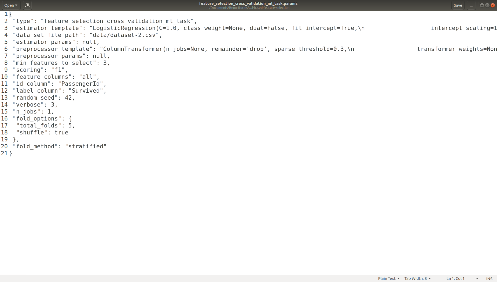
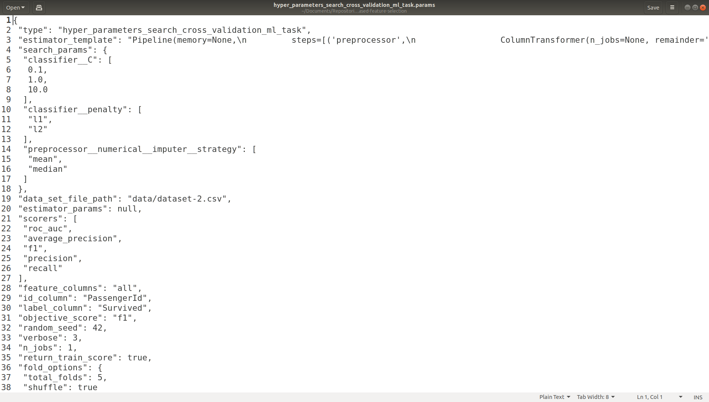
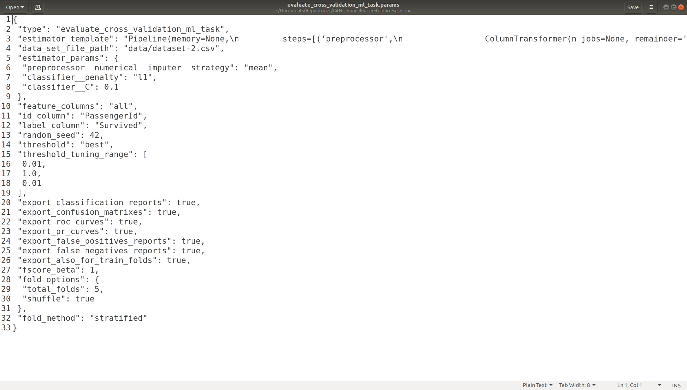

<br /><p align="center"><a href="https://www.medoid.ai/" target="_blank"></a></p>

## Sand

### What is it about?

Sand is a Python module for designing, running and tracking Machine Learning experiments / tasks. It is built on top of [scikit-learn](https://scikit-learn.org/) framework.

### How do I install it?

```sh
$ pip install sand
```

### Which are the components?

**NOTE** : Currently, binary classification is supported only.

| Component                      | What is this?                    |
|--------------------------------|----------------------------------|
| Base ML Task | An ML task is a configurable and reproducible piece of code built on top of scikit-learn that implements a repetitive Machine Learning task |
| Evaluation ML Task | This task can be used to evaluate a scikit-learn estimator on some data |
| Feature Selection ML Task | This task can be used to perform feature selection with Recursive Feature Elimination using a scikit-learn estimator on some data |
| Train ML Task | This task can be used to fit a scikit-learn estimator on some data |
| Hyperparameters Search ML Task | This task can be used to search the best hyperparameters of a scikit-learn estimator on some data |
| Experiments Runner | The experiments runner runs ML tasks in the context of an experiment |
| ML Tasks Runner | The ML tasks runner is like the experiments runner but without the "experiment" stuff, thus it can be used in the production world |

#### Evaluation ML Task

* Cross validation runs by default and can be configured to use either stratified k-folds or custom folds

* The provided estimator is not affected and is used only as a template

* The provided estimator can be either a scikit-learn ML model (eg: LogisticRegression) or a pipeline ending with an estimator

* The provided estimator needs to be able to predict probabilities through a ``predict_proba`` method

* The following evaluation results can be generated on-demand for train / test CV folds:

  * PR / ROC Curves (as interactive HTML plots)
  * Confusion Matrixes (as PNG images)
  * Classification Reports (as text)
  * Performance Metrics (as static HTML tables)
  * False Positives (as text)
  * False Negatives (as text)

* The evaluation results can be generated either for a specifc provided threshold or for the best one found from threshold tuning

* The threshold used along with its related performance metrics and summary metrics from all CV splits are returned as a result

#### Feature Selection ML Task

* Cross validation runs by default and can be configured to use either stratified k-folds or custom folds

* The provided estimator can be either a scikit-learn ML model (eg: LogisticRegression) or a pipeline ending with an estimator

* The provided estimator needs to provide feature importances through either a ``coef_`` or a ``feature_importances_`` attribute

* Along with the provided estimator a preprocessor can also be provided to preprocess the data before feature selection runs

* The provided estimator and preprocessor are not affected and are used only as templates

* The selected features can be either column names (from the original data) or column indexes (from the preprocessed data) depending on whether a preprocessor was used or not

* The selected features are stored in a text file and also returned as a result

#### Train ML Task

* The provided estimator is not affected and is used only as a template

* The provided estimator can be either a scikit-learn ML model (eg: LogisticRegression) or a pipeline ending with an estimator

* The fitted estimator is stored as a pickle file and also returned as a result

#### Hyperparameters Search ML Task

* Cross validation runs by default and can be configured to use either stratified k-folds or custom folds

* The provided estimator is not affected and is used only as a template

* The provided estimator can be either a scikit-learn ML model (eg: LogisticRegression) or a pipeline ending with an estimator

* The search can be either randomized or grid-based

* The search results as well as the best estimator found with its related hyperparameters and score are returned as a result

* The search results are stored in a file as a static HTML table

#### Experiments Runner

* Each experiment when it runs it leaves in a unique directory a footprint of metadata files (experiment source code, experiment ID, experiment date/time, experimenter name, experiment default / overloaded parameters in JSON format)

* Notifications can be send after running an ML task, through an easy to implement API (it can be useful for teams who need to get notified for the progress of the experiment, eg: in Slack)

* In case of error when running an ML task, a text file will be generated with the related error

#### ML Tasks Runner

* It runs the provided ML tasks and saves in a file the default / overloaded parameters in JSON format

* In case of error when running an ML task, a text file will be generated with the related error

### Why does exists?

It can help Data Scientists and Machine Learning Engineers:

* to keep track of modelling experiments / tasks

* to automate the repetitive (and boring) stuff when designing modelling pipelines

* to spend more time on the things that truly matter when solving a problem

### The people behind it

The following members of our team were involved in developing the initial release of this app:

* [Efstathios Chatzikyriakidis](https://github.com/echatzikyriakidis)

### Can I contribute?

Of course, the project is [Free Software](https://www.gnu.org/philosophy/free-sw.en.html) and you can contribute to it!

### What license do you use?

See our [LICENSE](LICENSE) for more details.

### How do I use it?

Many examples can be found in the [examples](examples) directory.

Below, is an example that uses many of Sand's components to built a machine learning modelling pipeline.

The experiment results can be found in the [example-pipeline-with-model-based-feature-selection](https://github.com/medoidai/sand/tree/master/examples/output/echatzikyriakidis-2020-07-05T18-47-54-example-pipeline-with-model-based-feature-selection) directory.

```python
from os import path

from sand.experiment import Experiment
from sand.train_ml_task import TrainMlTask
from sand.feature_selection_cross_validation_ml_task import FeatureSelectionCrossValidationMlTask
from sand.evaluate_cross_validation_ml_task import EvaluateCrossValidationMlTask
from sand.hyperparameters_search_cross_validation_ml_task import HyperParametersSearchCrossValidationMlTask
from sand.feature_selection.column_selector import ColumnSelector
from sand.notification.base_notifier import BaseNotifier

class ConsoleNotifier(BaseNotifier):
    def notify (self, message):
        print(message)

experiment = Experiment('output', __file__).set_experimenter('echatzikyriakidis').set_notifier(ConsoleNotifier()).build()

######### Experiment

from sklearn.compose import ColumnTransformer
from sklearn.pipeline import Pipeline
from sklearn.impute import SimpleImputer
from sklearn.preprocessing import StandardScaler, OneHotEncoder
from sklearn.linear_model import LogisticRegression

data_set_file_path = path.join('data', 'dataset-2.csv')

random_seed = 42

id_column = 'PassengerId'

label_column = 'Survived'

numeric_features = ['Age', 'Fare']

categorical_features = ['Embarked', 'Sex']

numeric_transformer = Pipeline(steps=[
    ('imputer', SimpleImputer()),
    ('scaler', StandardScaler())])

categorical_transformer = Pipeline(steps=[
    ('imputer', SimpleImputer(strategy='constant', fill_value='missing')),
    ('encoder', OneHotEncoder(handle_unknown='ignore'))])

preprocessor = ColumnTransformer(transformers=[
    ('numerical', numeric_transformer, numeric_features),
    ('categorical', categorical_transformer, categorical_features)])

classifier = LogisticRegression(solver='liblinear', random_state=random_seed)

search_params = {
    "classifier__C" : [ 1.e-01, 1.e+00, 1.e+01 ],
    "classifier__penalty" : [ "l1", "l2" ],
    "preprocessor__numerical__imputer__strategy" : [ "mean", "median" ]
}

features_columns = experiment.run(FeatureSelectionCrossValidationMlTask (estimator_template=classifier,
                                                                         data_set_file_path=data_set_file_path,
                                                                         preprocessor_template=preprocessor,
                                                                         min_features_to_select=3,
                                                                         id_column=id_column,
                                                                         label_column=label_column,
                                                                         random_seed=random_seed).stratified_folds(total_folds=5, shuffle=True))

pipe = Pipeline(steps=[('preprocessor', preprocessor),
                       ('selector', ColumnSelector(cols=features_columns)),
                       ('classifier', classifier)])

hyperparameters_search_results = experiment.run(HyperParametersSearchCrossValidationMlTask (estimator_template=pipe,
                                                                                            search_params=search_params,
                                                                                            data_set_file_path=data_set_file_path,
                                                                                            id_column=id_column,
                                                                                            label_column=label_column,
                                                                                            random_seed=random_seed).random_search(n_iters=100).stratified_folds(total_folds=5, shuffle=True))

evaluation_results = experiment.run(EvaluateCrossValidationMlTask(estimator_template=pipe,
                                                                  estimator_params=hyperparameters_search_results['best_params'],
                                                                  data_set_file_path=data_set_file_path,
                                                                  id_column=id_column,
                                                                  label_column=label_column,
                                                                  random_seed=random_seed,
                                                                  export_classification_reports=True,
                                                                  export_confusion_matrixes=True,
                                                                  export_pr_curves=True,
                                                                  export_roc_curves=True,
                                                                  export_false_positives_reports=True,
                                                                  export_false_negatives_reports=True,
                                                                  export_also_for_train_folds=True).stratified_folds(total_folds=5, shuffle=True))

train_results = experiment.run(TrainMlTask(estimator_template=pipe,
                                           estimator_params=hyperparameters_search_results['best_params'],
                                           data_set_file_path=data_set_file_path,
                                           id_column=id_column,
                                           label_column=label_column,
                                           random_seed=random_seed))

print(features_columns)

print(hyperparameters_search_results['best_params'])
print(hyperparameters_search_results['best_estimator'])
print(hyperparameters_search_results['best_score'])
print(hyperparameters_search_results['search_results'])

print(evaluation_results['threshold'])
print(evaluation_results['threshold_metrics'])
print(evaluation_results['splits_threshold_metrics'])
print(evaluation_results['splits_threshold_metrics_summary'])

print(train_results['estimator'])
```

### Results






